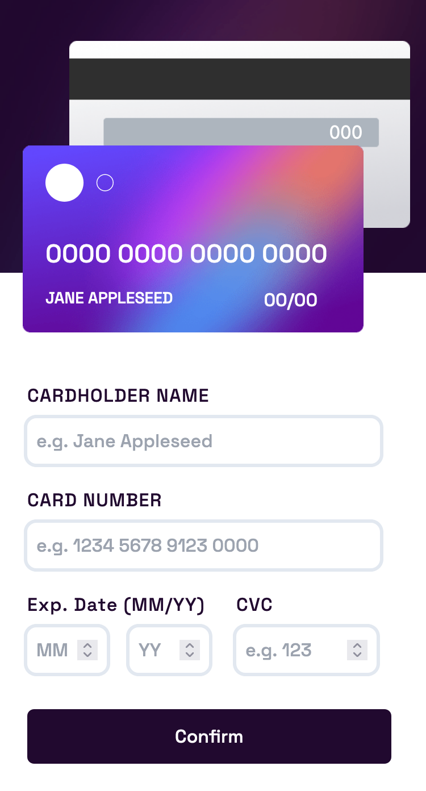

# Frontend Mentor - Interactive card details form solution

This is a solution to the [Interactive card details form challenge on Frontend Mentor](https://www.frontendmentor.io/challenges/interactive-card-details-form-XpS8cKZDWw). Frontend Mentor challenges help you improve your coding skills by building realistic projects.

## Table of contents

- [Overview](#overview)
  - [The challenge](#the-challenge)
  - [Screenshot](#screenshot)
  - [Links](#links)
- [My process](#my-process)
  - [Built with](#built-with)
  - [What I learned](#what-i-learned)
  - [Useful resources](#useful-resources)

## Overview

### The challenge

Users should be able to:

- Fill in the form and see the card details update in real-time
- Receive error messages when the form is submitted if:
  - Any input field is empty
  - The card number, expiry date, or CVC fields are in the wrong format
- View the optimal layout depending on their device's screen size
- See hover, active, and focus states for interactive elements on the page

### Screenshot

|  |  |
| ------------------------------------------------------ | ----------------------------------------------------- |

### Links

- [My Solution]()
- [Live Site URL]()

## My process

### Built with

- Semantic HTML5 markup
- CSS custom properties
- Flexbox
- CSS Grid
- Mobile-first workflow
- Tailwind CSS
- Javascript
- React js

### What I learned

### What I Learned

During the development of this project, I had the chance to enhance my React.js skills. I focused on form validation using React's useState for state management. This allowed me to implement real-time input validation, significantly improving the user experience.

### Useful resources

#### - [Stackoverflow](https://stackoverflow.com/) - A valuable platform for finding solutions to programming challenges and overcoming obstacles in your coding journey.

#### - [MDN DOCS](https://developer.mozilla.org/) - An exceptional resource providing comprehensive documentation for HTML, CSS, and JavaScript properties, among other web technologies.

#### - [Google Fonts](https://fonts.google.com/) - For all kinds of font styles.

#### - [Tailwind css](https://tailwindcss.com/) - The official tailwind css documentation.

#### - [React js](https://react.dev/) - The official documentation for React.js, a comprehensive and up-to-date resource for mastering React.

#### - [The Ultimate React Course 2023 by Jonas Schmedtmann](https://www.udemy.com/course/the-ultimate-react-course/) - A top-notch course offering an excellent opportunity to master React.js and build dynamic web applications.
